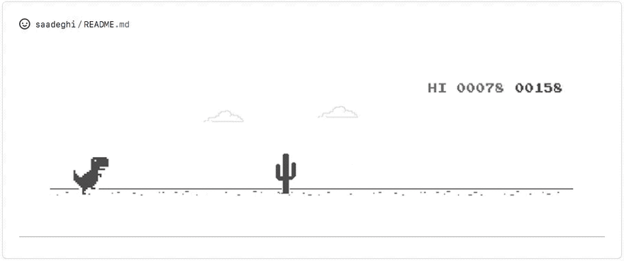

   <h1>Hello, I'm <a href="https://github.com/Husseinjan">Husseinjan</a>  </h1>

   &nbsp;&nbsp;
   &nbsp;&nbsp;
   &nbsp;&nbsp;
   &nbsp;&nbsp;
   &nbsp;&nbsp;

<h3>🙍‍♂️ Hussein Pulatov | 💻 Full Stack Developer | 🛸 Tajikistan  </h3>

   
     
   

 
 <h5 align="center">
   <i>⚡️ In IT & sports, as in life, the essence is to push beyond your limits. It's not about competing with others. The ability to surpass yourself is the true victory.⚡️</i>
</h5>
<h5 align="center">
<i>⚡️ В спорте и ИТ  - это, как и в жизни, сама суть в том, чтобы преодолеть свои границы. Это не соревнование с другими. Умение превзойти себя - вот настоящая победа⚡️</i>
</h5>

 

  <h3>I'm 21 years old. I'm a Full-Stack developer from Tajikistan.</h3>

- 🥀 Currently learning
- <i>JavaScript, TypeScript, React, and 69 others.</i>
- 🔭
- 🛸 Passionate about sports and bodybuilding
- I do fullstack and a little bit of everything :heart:
- All about living life to the fullest.
- 💬 Want to chat? Let's be friends 👉🏼[<i></i>](https://t.me/Hussein_7777)

 

  <h4> Full Stack | Competitive Programming </h4>

 

### - Languages and Tools...

  <!-- For more icons please follow  https://github.com/MikeCodesDotNET/ColoredBadges -->
      
  
  
  
  
  
  
  
  
  
  

### - What I do

 

   

   
   
 

<h2 align="center">🤝 Support</h2>

 🔥 Issues and 🥮 feature requests are welcome!

💙 If you like my projects, Give them a ⭐ and Share with friends!

Made with 💪 in Tajikistan

<h1 align='center'>⚡️<i>Stay strong and motivated!</i>⚡️</h1>

        

